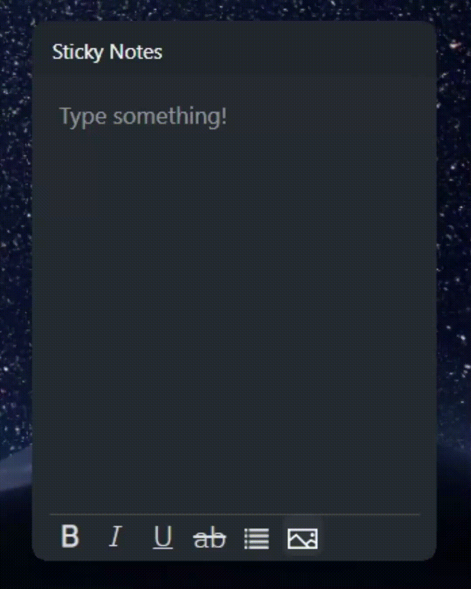
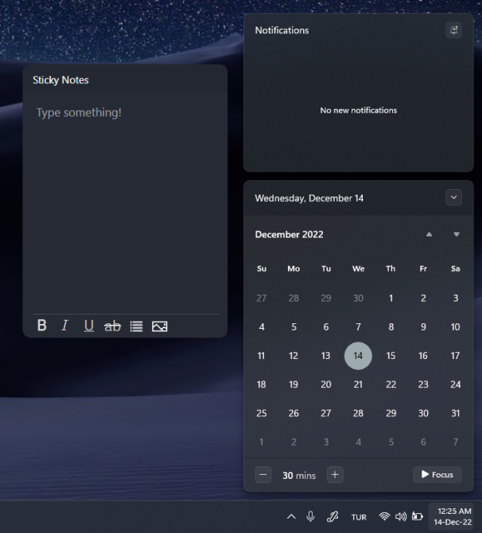
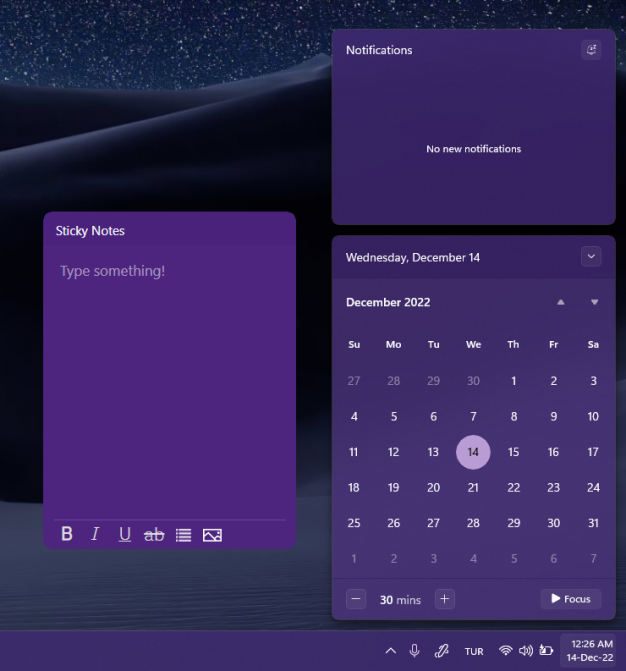
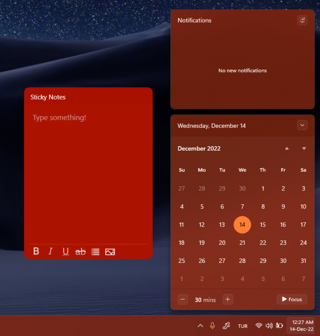

# sticky-notes-widget
A Windows 11 styled sticky notes widget, made with ElectronJS! It can stick to your desktop and theme itself after your system accent color!

## Table of Contents
* [About](#about)
* [Features](#features)
* [Media](#media)
* [Setup](#setup)
* <b>[Download](#download)</b>
* [Known Issues](#known-issues)
* [To-Do](#to-do)
* [Acknowledgements](#acknowledgements)
* [License](#license)
<!-- * [License](#license) -->

## About


This project was started as a result of my frustration about the fact that the default Sticky Notes app that comes bundled with Windows 11/10 is *not* actually sticky. I was able to find some alternatives using Rainmeter but they were either lacking, or didn't fit the Windows 11 design rules. So I just made my own! :)

## Features
* Allows you to bold, italicise, underline and strikethrough text. You can also embed images and lists.
* Autosaves after each key input.
* Is able to theme itself after your system accent color.
* Sticks to your desktop!

## Media
<div float="left" style="display: flex; flex-wrap: wrap;">
  
  
   
  
</div>
<br>

## Setup
To start, open a command prompt in the folder, and then run:
  ```npm
  npm install electron-forge
  ```

* In order to run the project, run:

    ```npm
    npm run start
    ```
* In order to package the project, run:

    ```npm
    npm run make
    ```
    Once it's finished, you should have both the installer and compiled app in the "out" folder. Make sure to rename "sticky-notes.exe" to "noteapp.exe", and then put "RUN.exe" from the project folder into your compiled app folder. <b> Use "RUN.exe" to start it up otherwise it won't stick to the desktop! </b>

## Download
Click <a href="https://github.com/JoveyMcJupi/sticky-notes-widget/releases">here</a> to download the latest version!

## Known Issues
* High memory usage when there's too much text.
* Hovering over the scrollbar doesn't change the mouse icon to default.
* Button toggle visuals do not always match their status.
* May not run on some systems (still trying to figure this one out).

## To-Do
* Make the widget start up on boot.
* Add multiple notes support.
* Always on top toggle button.
* Manual theme colors.
* Video support.
* Add the ability to move and change the size of images.
* Smooth pop-in and out animations for the scrollbar.
* Custom widget sizes.

## Acknowledgements
Many thanks to <a href="https://twitter.com/zsoltfox">Zsolt</a>, Loki and <a href="https://twitter.com/luxtsii">Lux</a> for helping me beta test this app!

## License
[](https://opensource.org/licenses/Apache-2.0)